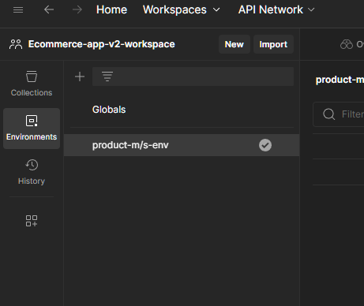
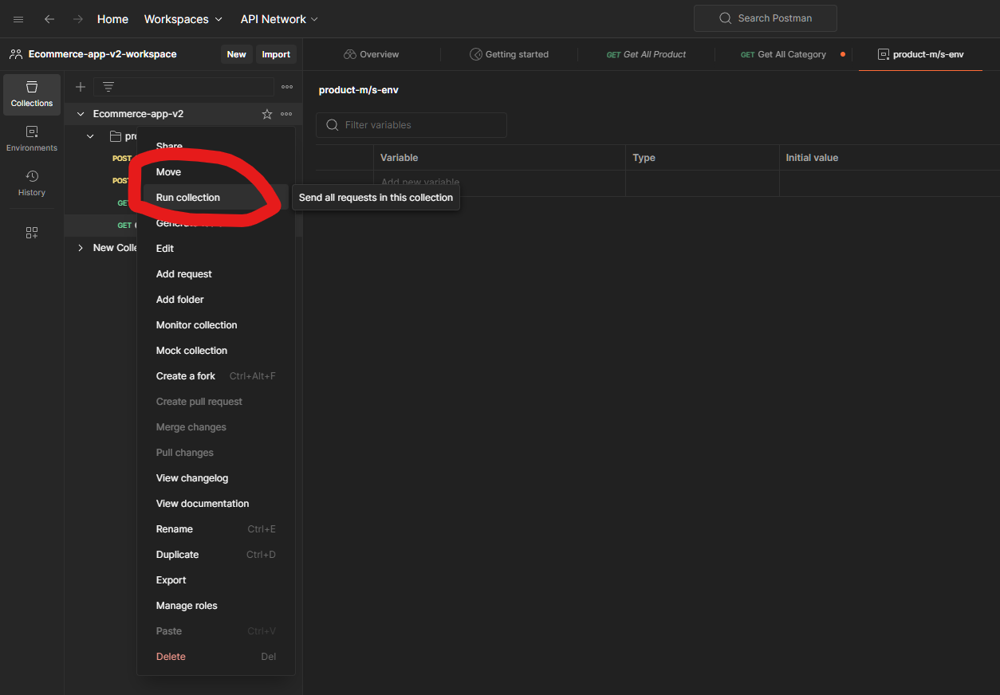
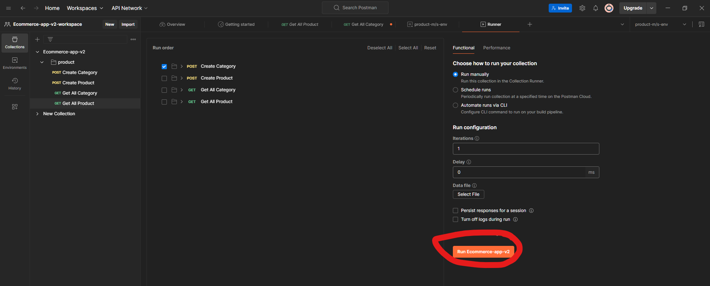

# User Microservice

Start the app
```sh
./gradlew bootRun
```
or 
```sh
yarn dev
```

Before start the app, make sure start the postgres docker container
```sh
docker-compose up -d
```
or
```sh
yarn start-db
```

# Testing Product API

Import `docs\postman-collection\Ecommerce-app-v2-product.postman_collection.json` to POSTMAN application.

Create an environment  


Run collection (POST create category then POST create product)  




If error happen, nuke postgres product db and retry!